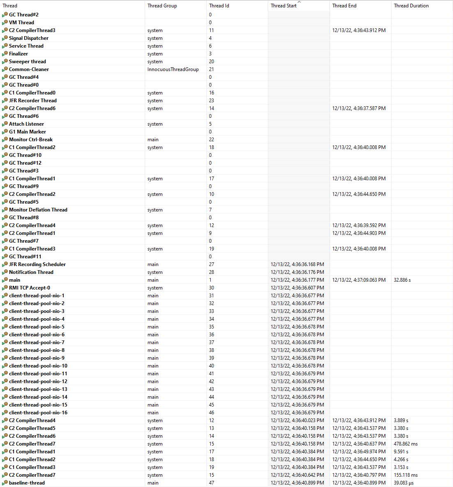
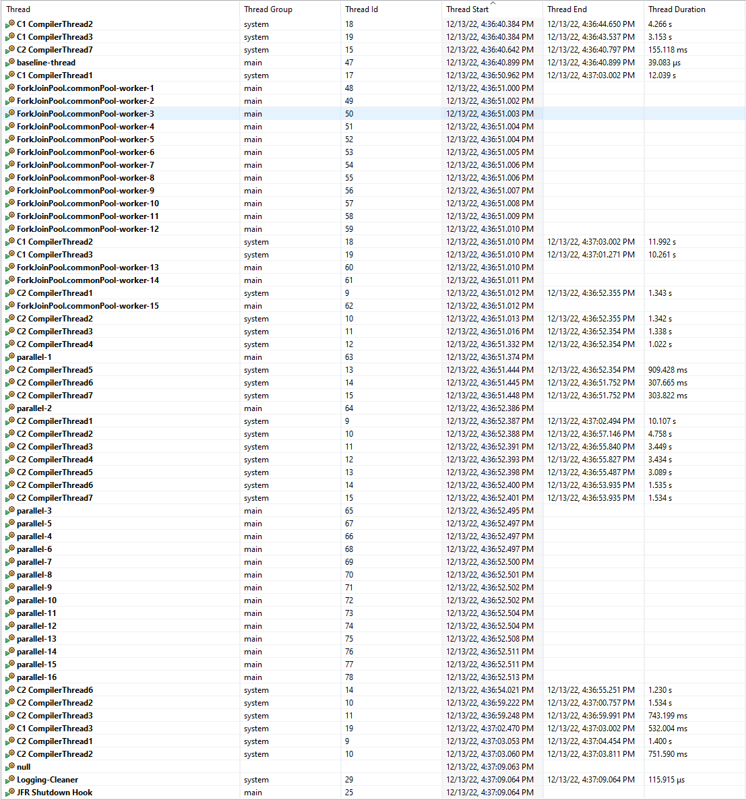

# Thread usage info in test

We used test `CanUseSingleConnectionPoolAndThreadPoolAcrossAzureClients.main` to simulate application running with 5000 Azure clients.
We also used [JFR](https://docs.oracle.com/javacomponents/jmc-5-4/jfr-runtime-guide/about.htm#JFRUH170) to record the thread usage info during our test running.

We deliberately added the following code to separate two simulated states in application, idle and running.
```java
new Thread("baseline-thread").start();
Thread.sleep(1000 * 10);
```

Here's the report generated by JFR and parsed by JMC, you can find the original jfr file in project root with name `flight.jfr`:

## Thread info

We sorted the thread record by thread start time. The threads are displayed in chronological order from top to bottom.

### Idle state



#### Explanation

Before `baseline-thread` kicks in, we constructed 5000 clients with a single HttpClient. You can see the thread pool threads（client-thread-pool-nio-xx) are eagerly started with 32 threads (twice the available processor count, configured in code)

### Running state


#### Explanation

After `baseline-thread` (notice the 10 seconds difference), we are doing actual API calls, and Azure Identity thread pool starts(ForkJoinPool.commonPool-worker-xx), with total 15 threads(available processor count -1, default by ForkJoinPool.commonPool()).

Finally, there are threads(parallel-x), caused by `Flux.blockLast`, which uses `Schedulers.parallel()` of 16 threads in total(available processor count).

## Thread pool and connection pool guidance:

https://gist.github.com/XiaofeiCao/f7590441fd116aa87ac1dd39be19ce29